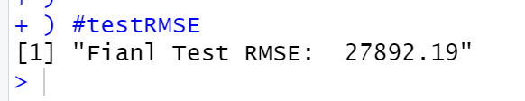
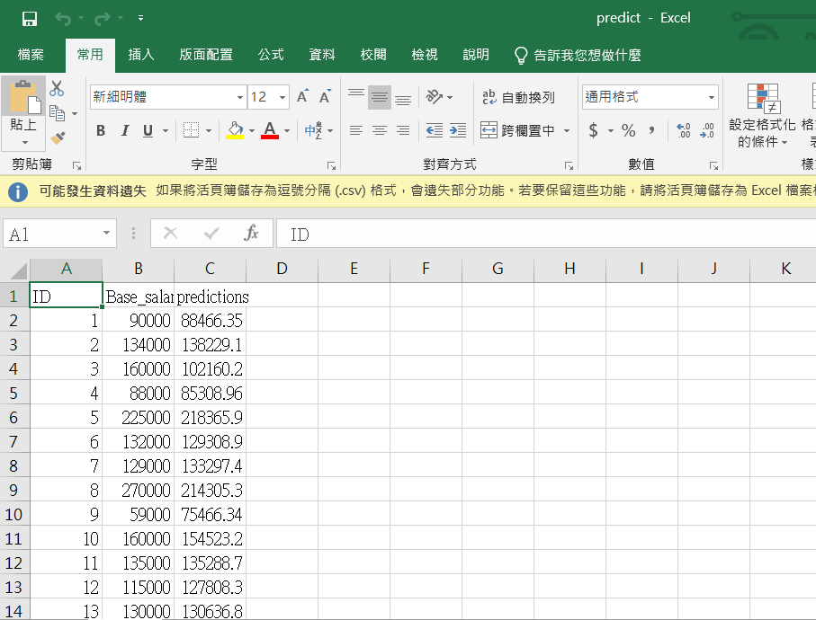

# RandomForest Predict Base_Salary

## Analyze Data

| Attribute | Property | Can be NULL |
|-----------|----------|-------------|
| X3 | char | 0 |
| X4 | need to deal, integer | 0 |
| X6 | need to deal, double | 0 |
| X7 | need to deal, double | 0 |
| Y | interest data | X |
| X10 | need to deal, double | 0 |
| X11 | need to deal, double | 0 |
| X12 | T, char (ignore) | 1 |
| X14 | need to deal, double (ignore city) | 0 |
| X15 | need to deal, double (dmaid???) | 1 |
| X16 | need to deal, integer (row number) | 0 |
| X17 | boolean(integer) | 0 |
| X18 | boolean(integer) | 0 |
| X19 | boolean(integer) | 0 |
| X20 | boolean(integer) | 0 |
| X21 | boolean(integer) | 0 |
| X22 | boolean(integer) | 0 |
| X23 | boolean(integer) | 0 |
| X24 | boolean(integer) | 0 |
| X25 | boolean(integer) | 0 |
| X26 | boolean(integer) | 1 |
| X27 | T, char | 1 |
| X28 | T, char | 1 |


## Code
```
Rscript randomForest.R --fold N --train ds_final/train_salary.csv --test ds_final/test_salary.csv --report performance.csv --predict predict.csv
```

## ScreenShot
### Final RMSE

-----------------------

### Performance

----------------------

### Predict

## Reference
[Car Price Prediction](https://rpubs.com/amir761/car_price_prediction_using_random_forest)

[ML Using R SEction 9 Random Forest](https://rstudio-pubs-static.s3.amazonaws.com/280316_f38c3e4dc75b48398e6e72a20c1ea0a9.html)


